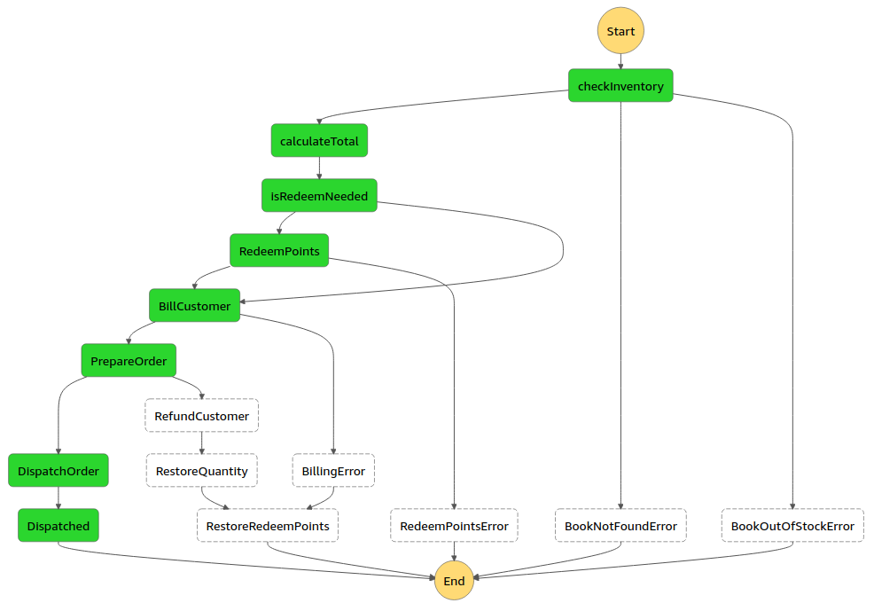

<p align="center">
  
</p>

<h1 align="center" style="margin-top:30px">
  Store Checkout State Machine
</h1>

<p align="center">Store checkout workflow developed using serverless technologies ☁️</p>

# 📚 Introduction

Workflow orchestration is not a simple task, specially when it comes to event-driven and microservices architectures. AWS Step Functions is a Serverless service that makes it easier to orchestrate complex complex scenarios

The POC in this repository is an book store checkout built on top of AWS Step Functions.


# 👨🏽‍🔧 Tech stack

- 🔧 <a href="https://aws.amazon.com/step-functions/?step-functions.sort-by=item.additionalFields.postDateTime&step-functions.sort-order=desc">AWS Step Functions</a> - serverless compute service that lets you run code without provisioning or managing servers, creating workload-aware cluster scaling logic, maintaining event integrations, or managing runtimes.
- 👷🏻 <a href="https://www.google.com/aclk?sa=L&ai=DChcSEwi65ZOUsO_wAhVBgJEKHUiuDwIYABABGgJjZQ&ae=2&sig=AOD64_1WI4JrkomIsRl4pzEy7HCKyY1qNQ&q=&ved=2ahUKEwjKh4yUsO_wAhWCJ7kGHYXxB8oQqyQoAHoECAEQEQ&adurl=">AWS Lambda</a> - serverless compute service that lets you run code without provisioning or managing servers, creating workload-aware cluster scaling logic, maintaining event integrations, or managing runtimes.
- 🗃️ <a href="https://docs.aws.amazon.com/amazondynamodb/latest/developerguide/Introduction.html">AWS DynamoDB</a> - fully managed NoSQL database service that provides fast and predictable performance with seamless scalability.
- ✉️ <a href="https://aws.amazon.com/sns/?whats-new-cards.sort-by=item.additionalFields.postDateTime&whats-new-cards.sort-order=desc">AWS SNS (Simple Notification Service)</a> - Fully managed pub/sub messaging, SMS, email, and mobile push notifications.
- 🗞 <a href="https://aws.amazon.com/sqs/">AWS SQS (Simple Queue Service)</a> - Fully managed message queues for microservices, distributed systems, and serverless applications.
- 🍃 <a href="https://www.serverless.com/">Serverless Framework</a> - framework that speeds up the development of Serverless cloud-native applications.

# 🖥️ Features

- Check inventory
- Calculate order total value
- Redeem points
- Bill customer
- Prepare order
- Dispatch order
- Refund customer
- Restore stock quantity
- Restore redeem points

# 🔗 Step Functions Direct Service integrations

- SQS - enqueue order once the costumer is billed
- SNS - notify the user by e-mail once the order is dispatched

# 📌 Design Patterns

- Saga Pattern - crucial pattern to rollback the previous states if something fails. For example, if the order fails, the workflow is expected to:

  1. Refund the customer
  2. Restore the stock quantity
  3. Restore redeem points

- Callback Pattern - this pattern is used by the direct integration between Step Functions and SQS. Once an order is prepared, it is sent to an SQS queue and the workflow waits for an response from the SQS worker (a Lambda function polling messages from the queue). This worker is responsible for processing the order and communicate back to Step Functions using an Task Token.

# ✔️ Requirements

- Node.js 12.x+
- AWS account
- AWS IAM user with administrator role and programmatic access (access key id and access secret key)
- Serverless Framework CLI globally installed on your machine

# ⚙️ Deploying the app

The stack deployment only requires a single command thanks to the Serverless Framework.

```
# Clone this repository
git clone https://github.com/eduardo3g/serverless-stepf-store-checkout.git

# Move yourself to the root directory
cd serverless-stepf-store-checkout

# Install the dependencies with NPM
npm install

# Deploy the stack (by detault it'll create a 'dev' stack)
serverless deploy
```

# 🌱 Seeding the database

Run the following command to seed books and users on DynamoDB tables. You should see a feedback in your terminal to validate if it succeeded or not.

```
# Generate a .env file on your root directory
npm run exportEnv

# Open the utility folder
cd src/util

# Run the scripts to create 2 books and 2 users on DynamoDB
node seed-books.js
node seed-users.js
```

# 🛠 Testing the workflow

After deploying and seeding the DynamoDB tables with fake data, it's time to finally test the Step Functions state machine.

- Open the DynamoDB tables (Books and Users) and grab the IDs (`bookId` and `userId` attributes).
- Open Step Functions and select the `StoreCheckoutFlow` state machine.
- Click on `Start execution` and pass the following input, replacing the userId and bookId by the ones you created during the database seed process:

```
{
  "userId": "01G4E1AZW2Q1X3QQEYBACQXMFH",
  "bookId": "01G4E1A9GF5CZWET09RSBR04PV",
  "quantity": 50,
  "redeem": true
}
```

- The execution will start and you'll be able to inspect in real-time the execution progress in the Step Functions UI.

# 🧪 Test results

The results below are from the perfect scenario. Unexpected errors happen, like not having the book on stock or any other issue. These scenarios are handled by the Saga Pattern implemented in this architecture.

- The customer will receive an e-mail with the order data
- The stock quantity will be updated on DynamoDB
- The user points will be deducted

# 🐞 Issues

Feel free to <b>create a new issue</b> with an detailed title and description. If you already have a solution to fix the problem, I would be very happy to <b>review your pull request</b>.

# 🎉 Contributing

I'm highly opened to contributions and would love to review pull requests to make this project even better.
